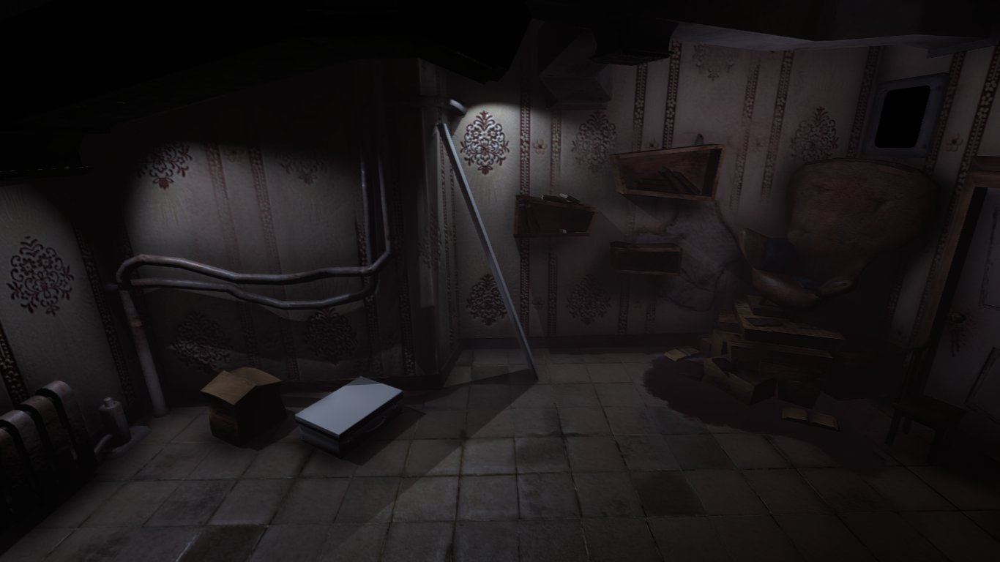

## Interrupted Dreams

### Concept

The world of the game is an unstable place, starting in a "Doll House" and gradually rolling down into a real nightmare. In other words, sleep was more often interrupted by adults and their problems. It could be screaming, hysterics, accidents, or even an elementary dropped glass with water in another room. One way or another all this was made into childish dreams.

But even a small incident in the real world of adults is an unpredictable thing in an interrupted child's dream, in which we will have to survive.

### Current Visuals:

### Current States:
	1. Modeling
	2. Texturing
	3. Implementing results
	4. Adding interactives  
